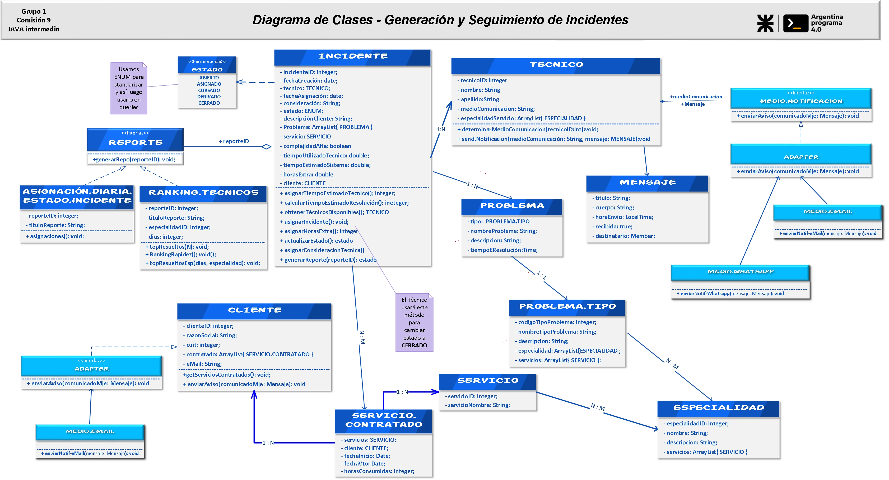
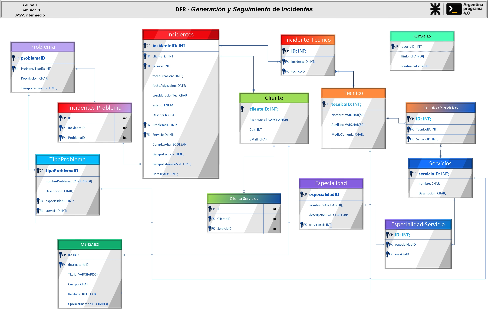

# Contenido

- [Sumario](#summary)
- [UML](#uml)
- [DER](#der)
 

  __JAVA MAVEN Project__
  Dependencias: 
>* __Lombok__
>* __mysql-connector-java__
>* __jdbc-mysql-plugin__
>* __mysql-jdbc__
>* __hibernate-core__
>* __javax / javaee-api (Dependencia para Java EE: incluye JPA)__

 Plug-in:
>* __maven-shade-plugin__

 Estructura - capas:
>* __config__
>* __controllers__
>* __DAO__
>* __models__
>* __services__

# <h1 align="center" >**Diagrama de Clases** </h1>
# uml

  

  

# der
# <h1 align="center" >__Diagrama de Entidad Relación__ </h1>

  

